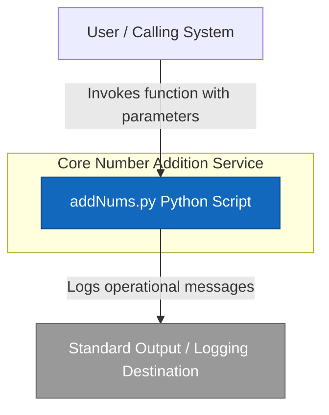
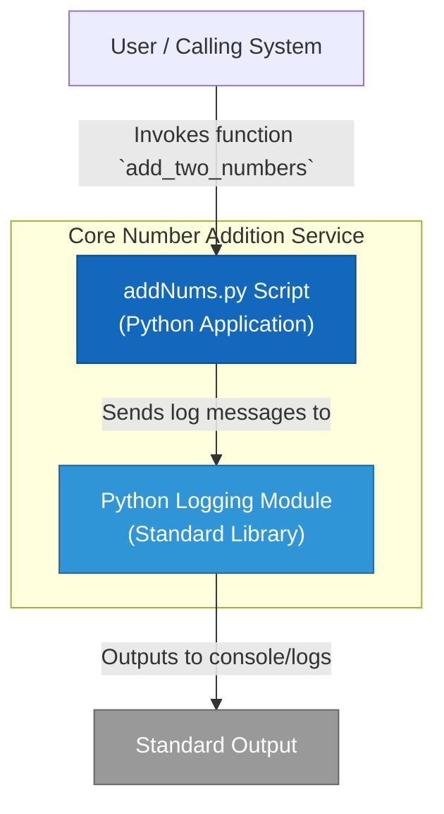

```markdown
# ARCHITECTURE.md: Core Number Addition Service

This document provides a high-level overview of the architecture of the Core Number Addition Service, focusing on its context, major components, and how they interact. It utilizes C4 model-inspired diagrams to illustrate the system's structure and behavior.

## 1. System Context (C4 Level 1)

This diagram illustrates how the "Core Number Addition Service" fits into a broader environment. It's a fundamental utility designed to perform number addition, interacting with a calling system and outputting logs.


**Explanation:**
The Core Number Addition Service, embodied by the `addNums.py` script, receives input from a `User` or another `Calling System`. Its primary function is to perform arithmetic addition and output operational messages (information, potential errors) to a `Standard Output / Logging Destination`.

## 2. Container Diagram (C4 Level 2)

This diagram zooms into the "Core Number Addition Service" to show its high-level technical building blocks. Given its small scope, the "containers" are the script itself and its direct standard library dependency.


**Explanation:**
The `User / Calling System` directly interacts with the `addNums.py Script`. This script, acting as the main application container, uses the standard `Python Logging Module` for all informational output. The logging module, in turn, directs these messages to `Standard Output`.

## 3. Component Diagram (C4 Level 3)

This diagram provides a detailed view inside the `addNums.py Script` container, showing its internal components and their interactions.

```mermaid
graph TD
    subgraph "addNums.py Script"
        A[add_two_numbers(num1, num2, corrID)]
        B{Input Conversion\n(int())}
        C[Arithmetic Core\n(num1_int + num2_int)]
        D[Logging Integration Logic\n(prefix creation, logging.info)]
        E[Global correlation_ID\n(Hardcoded Default)]
    end
    F[Python Logging Module]

    A -- "1. Orchestrates" --> B
    B -- "2. Success" --> C
    C -- "3. Result" --> A
    A -- "4. Sends messages via" --> D
    D -- "5. Uses/Falls back to" --> E
    D -- "6. Submits log records" --> F
```
**Explanation:**
The core of the service is the `add_two_numbers` function (A). It first attempts `Input Conversion` (B) for both `num1` and `num2`. Upon successful conversion, it delegates to the `Arithmetic Core` (C) for the actual addition. All operational steps are logged through the `Logging Integration Logic` (D), which constructs log message prefixes using either an explicit `corrID` parameter or the `Global correlation_ID` (E). Finally, `Logging Integration Logic` interacts with the `Python Logging Module` (F) to emit log messages.

**Key Architectural Concerns (from analysis):**
*   **Critical DoS Vulnerability**: The `Input Conversion` component (B) lacks `try-except` blocks, meaning non-numeric input will cause the script to crash, leading to a Denial of Service.
*   **Tight Coupling of Logging**: The `Logging Integration Logic` (D) is embedded within the function, manually creating prefixes. This couples logging format concerns with business logic.
*   **Global State Dependency**: The `Global correlation_ID` (E) is a hardcoded, mutable global variable, introducing hidden dependencies and limiting traceability.

## 4. Data Flow / Sequence Diagram

This diagram illustrates a typical scenario for the `add_two_numbers` function, highlighting both a successful execution path and a critical failure path due to invalid input.

```mermaid
sequenceDiagram
    participant Caller
    participant AddFunc as add_two_numbers()
    participant IntConvert as int() conversion
    participant Arithmetic as Arithmetic Operation
    participant Logger as Python Logging Module

    rect rgb(220, 255, 220)
        box Green: Successful Execution
        Caller->>AddFunc: Call(num1=5, num2=3, corrID="req1")
        activate AddFunc
        AddFunc->>Logger: Log: Function entry (corrID: req1)
        AddFunc->>IntConvert: Convert num1 (5)
        IntConvert-->>AddFunc: Returns 5 (int)
        AddFunc->>IntConvert: Convert num2 (3)
        IntConvert-->>AddFunc: Returns 3 (int)
        AddFunc->>Arithmetic: Calculate (5 + 3)
        Arithmetic-->>AddFunc: Returns 8
        AddFunc->>Logger: Log: Result is 8 (corrID: req1)
        AddFunc-->>Caller: Return 8
        deactivate AddFunc
    end

    rect rgb(255, 220, 220)
        box Red: Critical DoS Vulnerability
        Caller->>AddFunc: Call(num1="bad", num2=3, corrID="req2")
        activate AddFunc
        AddFunc->>Logger: Log: Function entry (corrID: req2)
        AddFunc->>IntConvert: Convert num1 ("bad")
        Note over IntConvert,AddFunc: ValueError occurs here!
        IntConvert--xAddFunc: **CRASH: ValueError** (Unhandled input)
        deactivate AddFunc
        Note right of AddFunc: Application terminates due to unhandled exception.
    end
```
**Explanation:**
The sequence diagram demonstrates a successful call where inputs are converted and added, and results are logged. Crucially, it also illustrates the DoS vulnerability: when non-numeric input is provided, the `int()` conversion fails with a `ValueError`, which is unhandled, causing the entire script to crash and terminate.

## 5. Infrastructure / Deployment Diagram

This diagram outlines a simple deployment model for the `addNums.py` script, which is essentially a standalone Python application.

```mermaid
graph TD
    Client((Client/User)) -- "Triggers Execution" --> ExecutionHost[Generic Execution Host\n(e.g., Server, Workstation, Docker Container)]
    ExecutionHost -- "Runs with" --> PythonInterpreter[Python Interpreter]
    PythonInterpreter -- "Executes" --> AddNumsScript[addNums.py Script]
    AddNumsScript -- "Writes logs to" --> StdoutLogs[Standard Output / Log Files]

    style ExecutionHost fill:#1168bd,stroke:#0b4884,color:#ffffff
    style PythonInterpreter fill:#2f95d6,stroke:#206895,color:#ffffff
    style AddNumsScript fill:#2f95d6,stroke:#206895,color:#ffffff
    style StdoutLogs fill:#999999,stroke:#666666,color:#ffffff
```
**Explanation:**
A `Client / User` initiates the execution of the `addNums.py Script` on a `Generic Execution Host` (which could be any environment capable of running Python, such as a server, a developer's workstation, or a Docker container). The `Python Interpreter` loads and runs the script, and any output (logs, results) is directed to `Standard Output / Log Files`.

## Legend & Conventions

| Symbol | Meaning |
| :---: | :--- |
| 🔵 | **System / Container**: Major software block |
| ⚪ | **Person / Actor**: Human user or role |
| 🛢️ | **Database**: Persistent storage (N/A for this project) |
| ⬜ | **External System**: Third-party service |
| ──► | **Relationship**: Direction of dependency or data flow |

---
*Note: These diagrams are generated using [Mermaid](https://mermaid.js.org/). You can edit the code blocks directly to update the architecture.*
```