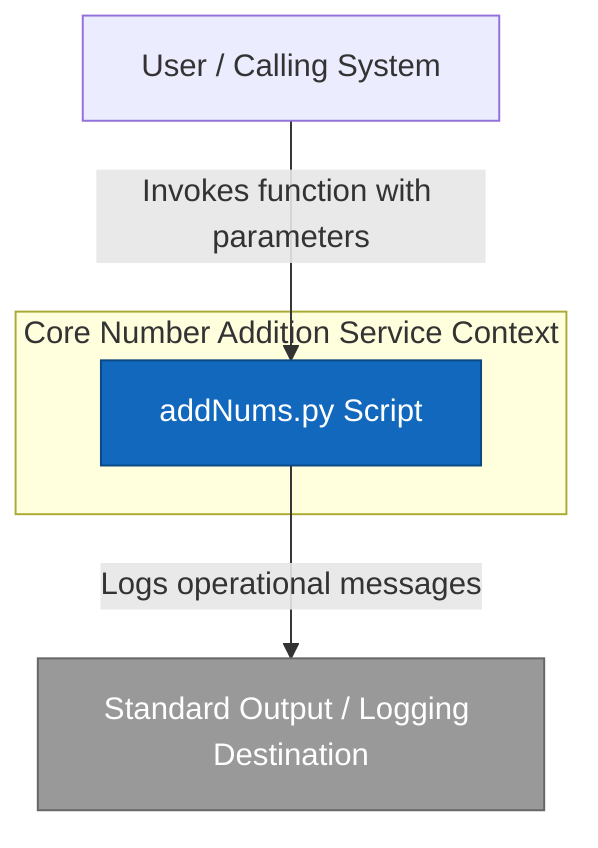
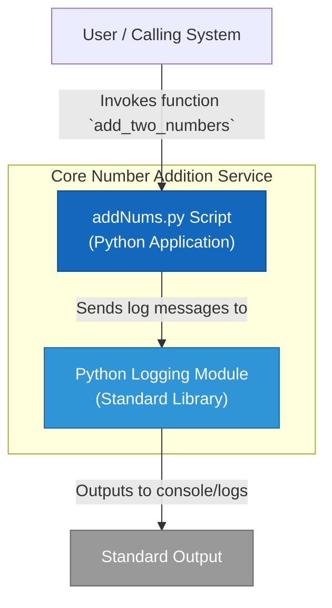
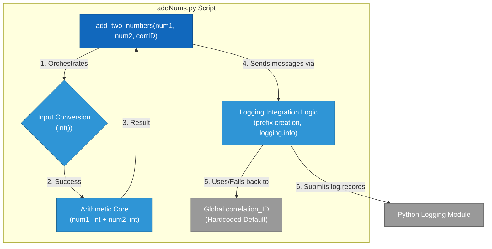
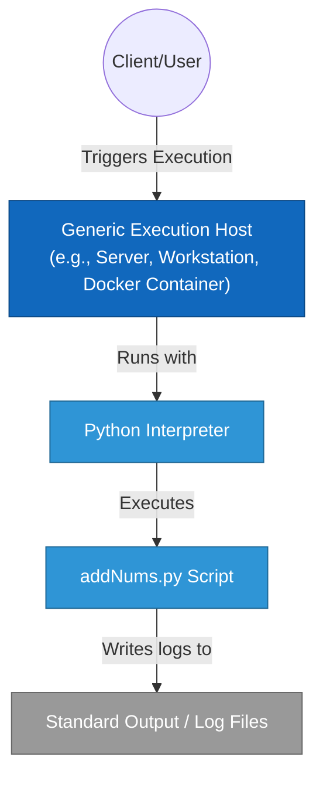

# Architecture Diagrams Template

This document serves as a template for documenting the architecture of your software project. Use the diagrams below as a starting point and adapt them to reflect your specific system.

## 1. System Context (C4 Level 1)

This diagram shows the big picture: how your system fits into the existing IT landscape and how it interacts with users and external systems.



## 2. Container Diagram (C4 Level 2)

This diagram zooms into the system boundary to show the high-level technical building blocks (containers) like web apps, mobile apps, APIs, and databases.



## 3. Component Diagram (C4 Level 3)

This diagram zooms into a specific container (e.g., the API Application) to show its internal components and how they interact.



## 4. Data Flow / Sequence Diagram

Use this diagram to illustrate a complex business process or data flow through the system.

**Scenario: add_two_numbers Function Execution**

```mermaid
sequenceDiagram
    participant Caller
    participant AddFunc as add_two_numbers()
    participant IntConvert as int() conversion
    participant Arithmetic as Arithmetic Operation
    participant Logger as Python Logging Module

    rect rgb(220, 255, 220)
        box Green: Successful Execution
        Caller->>AddFunc: Call(num1=5, num2=3, corrID="req1")
        activate AddFunc
        AddFunc->>Logger: Log: Function entry (corrID: req1)
        AddFunc->>IntConvert: Convert num1 (5)
        IntConvert-->>AddFunc: Returns 5 (int)
        AddFunc->>IntConvert: Convert num2 (3)
        IntConvert-->>AddFunc: Returns 3 (int)
        AddFunc->>Arithmetic: Calculate (5 + 3)
        Arithmetic-->>AddFunc: Returns 8
        AddFunc->>Logger: Log: Result is 8 (corrID: req1)
        AddFunc-->>Caller: Return 8
        deactivate AddFunc
    end

    rect rgb(255, 220, 220)
        box Red: Critical DoS Vulnerability
        Caller->>AddFunc: Call(num1="bad", num2=3, corrID="req2")
        activate AddFunc
        AddFunc->>Logger: Log: Function entry (corrID: req2)
        AddFunc->>IntConvert: Convert num1 ("bad")
        Note over IntConvert,AddFunc: ValueError occurs here!
        IntConvert--xAddFunc: **CRASH: ValueError** (Unhandled input)
        deactivate AddFunc
        Note right of AddFunc: Application terminates due to unhandled exception.
    end
```

## 5. Infrastructure / Deployment Diagram

This diagram shows how the software containers are mapped to infrastructure (cloud, on-premise, hardware).



## Legend & Conventions

| Symbol | Meaning |
| :---: | :--- |
| 🔵 | **System / Container**: Major software block |
| ⚪ | **Person / Actor**: Human user or role |
| 🛢️ | **Database**: Persistent storage |
| ⬜ | **External System**: Third-party service |
| ──► | **Relationship**: Direction of dependency or data flow |

---
*Note: These diagrams are generated using [Mermaid](https://mermaid.js.org/). You can edit the code blocks directly to update the architecture.*