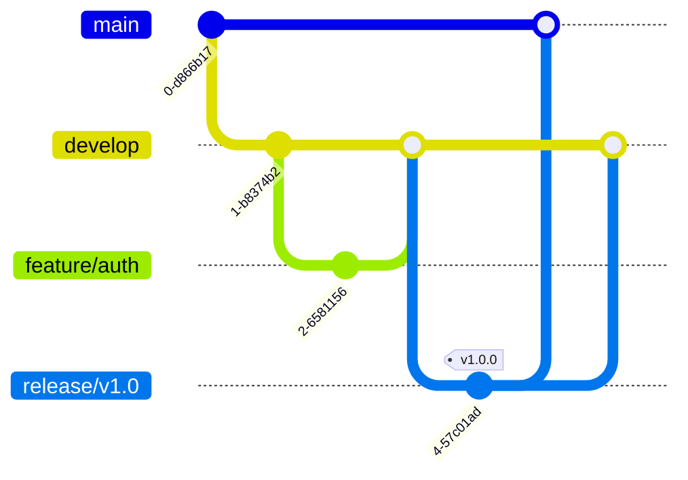

# Version Control & Branching Strategy

This document outlines the branching strategy used by the engineering team. We utilize a strict **Gitflow** workflow to ensure stability in production (`main`) while maintaining a high velocity of feature development (`develop`).

## Overview

Our repository is structured around two infinite lifespan branches:

*   **`main`**: The production-ready state. Do not commit directly to this branch.
*   **`develop`**: The integration branch for features. This contains the latest delivered development changes for the next release.

> **Principle:** The `main` branch must always be deployable. If `main` is broken, fixing it is the single highest priority.



-----

## Branch Types & Naming Conventions

We use specific prefixes to categorize branches. Please adhere to these naming standards strictly.

| Branch Type | Prefix | Source Branch | Merge Target | Example |
| :--- | :--- | :--- | :--- | :--- |
| **Feature** | `feature/` | `develop` | `develop` | `feature/add-new-functionality` |
| **Bugfix** | `fix/` | `develop` | `develop` | `fix/input-validation` |
| **Release** | `release/` | `develop` | `main` & `develop` | `release/v1.0.0` |
| **Hotfix** | `hotfix/` | `main` | `main` & `develop` | `hotfix/dos-vulnerability` |

-----

## Workflows

### 1\. Feature Development

Used for new features or non-critical improvements.

1.  **Create** the branch from `develop`.
    ```bash
    git checkout develop
    git pull origin develop
    git checkout -b feature/my-new-feature
    ```
2.  **Commit** changes frequently.
3.  **Open a Pull Request (PR)** targeting `develop`.
4.  **Merge** after code review approval and CI checks pass.

### 2\. Release Cycle

Used to prepare a new production version (QA, documentation, version bumping).

1.  **Create** the branch from `develop` when features are "code complete."
    ```bash
    git checkout -b release/v1.0.0
    ```
2.  **Stabilize:** Only bug fixes and documentation updates are allowed here. No new logic.
3.  **Merge:**
      * Merge into `main` (triggers production deployment).
      * Merge back into `develop` (to ensure fixes are saved for the future).
4.  **Tag:** strictly follow Semantic Versioning.
    ```bash
    git tag -a v1.0.0 -m "Production Release v1.0.0"
    ```

### 3\. Hotfixes

Used solely for critical bugs in production that cannot wait for the next scheduled release.

1.  **Create** the branch directly from `main`.
    ```bash
    git checkout main
    git checkout -b hotfix/security-patch
    ```
2.  **Fix** the issue.
3.  **Merge** into **both** `main` and `develop`.
    > [!WARNING]
    > Forgetting to merge the hotfix back into `develop` will cause the bug to regress in the next release. In the context of the Core Number Addition Service, this would be particularly relevant if a fix for the Denial of Service vulnerability wasn't merged back into `develop`, potentially reintroducing it.

-----

## Pull Request (PR) Standards

To maintain code quality and auditability (crucial for Web3 security), all PRs must meet the following criteria:

### Title Format

Use [Conventional Commits](https://conventionalcommits.org/) structure:

  * `feat: allow user to stake tokens`
  * `fix: prevent underflow in relay service`
  * `chore: update dependency versions`

### Description Template

```markdown
## Summary
Briefly explain the changes.

## Context
Link to [Issue Tracker] ticket or GitHub Issue.

## Checklist
- [ ] Tests added/updated
- [ ] Local build passes
- [ ] Linter check passes
- [ ] (If Web3) Smart Contract interaction verified on [Testnet Name]
```

-----

## Git Hooks (Husky)

We enforce specific checks locally before you can commit or push.

  * **`pre-commit`**: Runs linting (ESLint/Prettier) and unit tests on staged files.
  * **`commit-msg`**: Validates that your commit message follows the `type: subject` format.

> If you need to bypass hooks for a work-in-progress save (not recommended), use the `--no-verify` flag.

```bash
git commit -m "wip: saving work" --no-verify